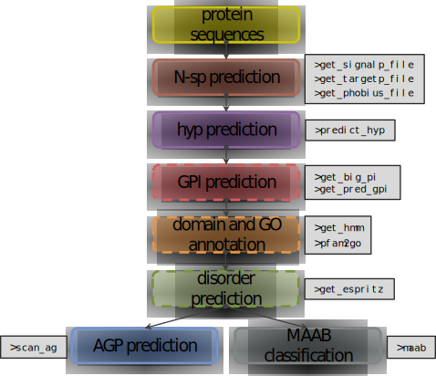

```{r setup, include = FALSE}
knitr::opts_chunk$set(
  collapse = TRUE,
  comment = "#>",
  echo = TRUE,
  warning = FALSE,
  message = FALSE,
  prompt = FALSE,
  fig.pos = 'h',
  highlight = FALSE
)
knitr::knit_theme$set("edit-matlab")
```

```{r set-options, echo=FALSE}
options(width = 120)
```

What is ragp?
=============

Hydroxyproline rich glycoproteins (HRGPs) are one of the most complex families of macromolecules found in plants, due to the diversity of glycans decorating the protein backbone, as well as the heterogeneity of the protein backbones. While this diversity is responsible for the wide array of physiological functions associated with HRGPs, it hinders attempts for homology based identification. Current approaches, based on identifying sequences with characteristic motifs and biased amino acid composition, are limited to prototypical sequences.  

`ragp` is an R package for mining and analyses of HRGPs, with emphasis on arabinogalactan protein sequences (AGPs). The `ragp` filtering pipeline exploits one of the HRGPs key features, the presence of hydroxyprolines which represent glycosylation sites. Main package features include prediction of proline hydroxylation sites, amino acid motif and bias analyses, efficient communication with web servers for prediction of N-terminal signal peptides and glycosylphosphatidylinositol modification sites, as well as the ability to annotate sequences through [CDD](https://www.ncbi.nlm.nih.gov/Structure/bwrpsb/bwrpsb.cgi) or [hmmscan](https://www.ebi.ac.uk/Tools/hmmer/search/hmmscan) and subsequent [GO](http://www.geneontology.org/) enrichment, based on predicted [Pfam](https://pfam.xfam.org/) domains.

The workflow in `ragp` is illustrated with the following diagram (`ragp` functions to be used for each of the tasks are boxed grey): 

```{r echo = FALSE, out.width = "60%", fig.align = "center"}

```   

The filtering layer:

* predict the presence of secretory signals (N-sp) and filter sequences containing them. Several prediction algorithms are available. Currently recommended is to use `get_signalp5()` which queries [SignalP5](https://services.healthtech.dtu.dk/service.php?SignalP-5.0) [@armenteros_signalp5_2019].  
* predict proline hydroxylation (`predict_hyp()`) and filter sequences containing several (for example three or more) potential hydroxyprolines.

The analysis layer:

* find localized clusters of characteristic arabinogalactan motifs (AG glycomodules) to identify potential AGPs (`scan_ag()`) among the hydroxyproline containing sequences.
* perform motif and amino acid bias (MAAB, [@johnson_pipeline_2017]) classification scheme (`maab()`) to classify hydroxyproline containing sequences.
* annotate domains using [Pfam](https://pfam.xfam.org/) (`get_hmm()`) and enrich with gene ontology (GO) terms (`pfam2go()`). Alternatively annotate domains using [CDD](https://www.ncbi.nlm.nih.gov/Structure/bwrpsb/bwrpsb.cgi).  
* predict the presence of potential glycosylphosphatidylinositol attachment sites (`get_big_pi()`, `get_pred_gpi()` and `get_netGPI()`).  
* predict disordered regions in proteins (`get_espritz()`). 
* predict transmembrane regions in proteins (`get_phobius()` and `get_tmhmm()`)

Additionally `ragp` provides tools for visualization of the mentioned attributes via `plot_prot()`.


Installation
------------

There are several ways to install R packages hosted on git-hub, however the simplest is to use `devtools::install_github()` which will perform all the required steps automatically.

To install `ragp` run:

```{r gh-installation1, warning = FALSE, message = FALSE, eval = FALSE}
#install.packages("devtools") #if it is not installed on your system
devtools::install_github("missuse/ragp")
```

alternatively run:  

```{r gh-installation2, warning=FALSE, message=FALSE, eval = FALSE}
# install.packages("devtools")
devtools::install_github("missuse/ragp",
                         build_vignettes = TRUE)
```

to build vignettes which can be viewed by:  

```{r gh-installation3, warning=FALSE, message=FALSE, eval = FALSE}
browseVignettes("ragp")
```


Data import
===========

Inputs
------

Most `ragp` functions require single letter protein sequences and the corresponding identifiers as input. These can be provided in the form of basic `R` data types such as vectors or data frames. Additionally `ragp` imports the [`seqinr`](https://cran.r-project.org/web/packages/seqinr/index.html) package for the manipulation of `.FASTA` files, so the input objects can be a list of [`SeqFastaAA`](https://search.r-project.org/CRAN/refmans/seqinr/html/SeqFastaAA.html) objects returned by the `seqinr::read.fasta()`. The location of a `.FASTA` file is also possible as a type of input. As of ragp version 0.3.5 objects of class [`AAStringSet`](https://web.mit.edu/~r/current/arch/i386_linux26/lib/R/library/Biostrings/html/XStringSet-class.html) are also supported.

Input options will be illustrated using `scan_ag()` function:  

* provide a `character` vector of protein sequences to the `sequence` argument and a `character` vector of protein identifiers to the `id` argument:  
```{r input 1}
library(ragp)
data(at_nsp) #a data frame of 2700 Arabidopsis sequences
input1 <- scan_ag(sequence = at_nsp$sequence,
                  id = at_nsp$Transcript.id) 
```  

* provide a `data.frame` to `data` argument, and names of columns containing the protein sequences and corresponding identifiers to `sequence` and `id` arguments:   

```{r input 2}
input2 <- scan_ag(data = at_nsp,
                  sequence = "sequence",
                  id = "Transcript.id") 
```   

quoting column names is not necessary:   

```{r input 3}
input3 <- scan_ag(data = at_nsp,
                  sequence = sequence,
                  id = Transcript.id) 
```   

* provide a list of `SeqFastaAA` objects to `data` argument: 

```{r input 4}
library(seqinr) #to create a fasta file with protein sequences

#write a FASTA file
seqinr::write.fasta(sequence = strsplit(at_nsp$sequence, ""),
                    name = at_nsp$Transcript.id, file = "at_nsp.fasta")

#read a FASTA file to a list of SeqFastaAA objects
At_seq_fas <- read.fasta("at_nsp.fasta",
                         seqtype =  "AA", 
                         as.string = TRUE) 

input4 <- scan_ag(data = At_seq_fas) 
```   

* provide the location of a `.FASTA` file to be analyzed as string:  

```{r input 5}
input5 <- scan_ag(data = "at_nsp.fasta") #file at_nsp.fasta is in the working directory
```  

* provide an [`AAStringSet`](https://web.mit.edu/~r/current/arch/i386_linux26/lib/R/library/Biostrings/html/XStringSet-class.html) object:  

```{r input 6}
dat <- Biostrings::readAAStringSet("at_nsp.fasta") #file at_nsp.fasta is in the working directory
input6 <- scan_ag(data = dat) 
```  

All of the outputs are equal:

```{r equal}
all.equal(input1,
          input2)

all.equal(input1,
          input3)

all.equal(input1,
          input4)

all.equal(input1,
          input5)

all.equal(input1,
          input6)
```

The only exceptions to this design are the plotting function `plot_prot()` which requires protein sequences to be supplied in the form of string vectors (input1 in the above example) and `pfam2go()` which does not take sequences as input.

Further reading
===============

All `ragp` functions return basic R data structures such as data frames, lists of vectors and lists of data frames, making them convenient for manipulation to anyone familiar with R. An especially effective way to manipulate these objects is by utilizing the [`tidyverse`](https://www.tidyverse.org/) collection of packages, especially [`dplyr`](https://dplyr.tidyverse.org/) and [`ggplot2`](https://ggplot2.tidyverse.org/). Several [`dplyr`](https://dplyr.tidyverse.org/) functions that will be especially handy for data wrangling are:  

* `dplyr::left_join()`
* `dplyr::mutate()`
* `dplyr::group_by()`
* `dplyr::summarise()`
* `dplyr::filter()`
* `dplyr::distinct()`


Examples on usage of these functions on objects returned by `ragp` functions are provided in [HRGP filtering](https://missuse.github.io/ragp/articles/pkgdown/filter) and [HRGP analysis](https://missuse.github.io/ragp/articles/pkgdown/analyse) tutorials. Additionally there are extensive examples on the internet on usage of the mentioned functions. 

Obtaining pretty visualizations is usually the goal of the above mentioned data manipulations. The golden standard of R graphics at present is the [ggplot2](https://ggplot2.tidyverse.org/) package and we recommend it to graphically summarize the data. Additionally `ragp` contains `plot_prot()` function which is a wrapper for `ggplot2`, and while `plot_prot()` can be used without knowing `ggplot2` syntax, to tweak the plot style at least a basic knowledge of `ggplot2` is required. Examples are provided in [protein sequence visualization](https://missuse.github.io/ragp/articles/pkgdown/PSV) tutorial.


Acknowledgements
================

This software was developed with funding from the Ministry of Education, Science and Technological Development of the Republic of Serbia (Projects TR31019 and OI173024).

References  
==========