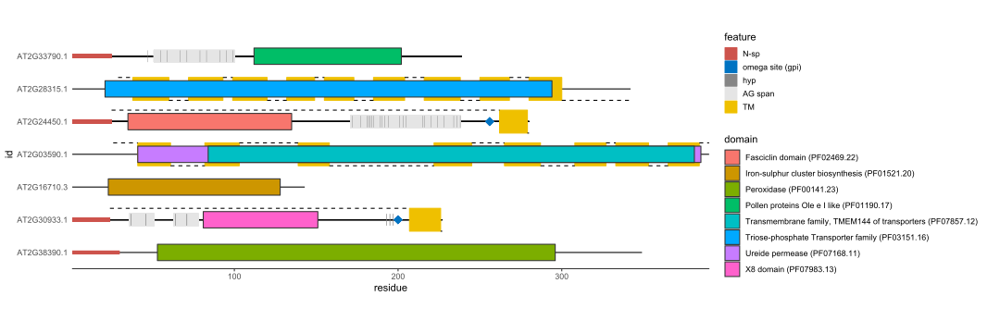
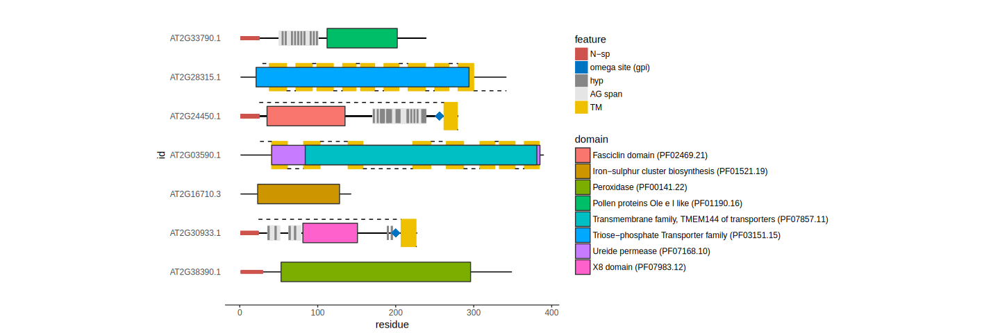
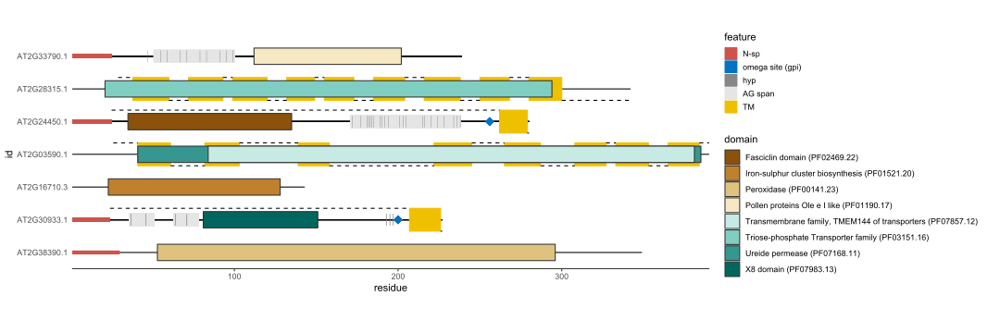
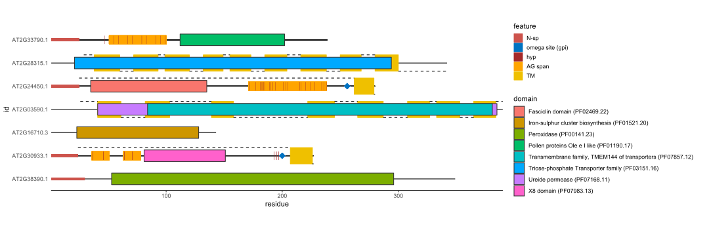
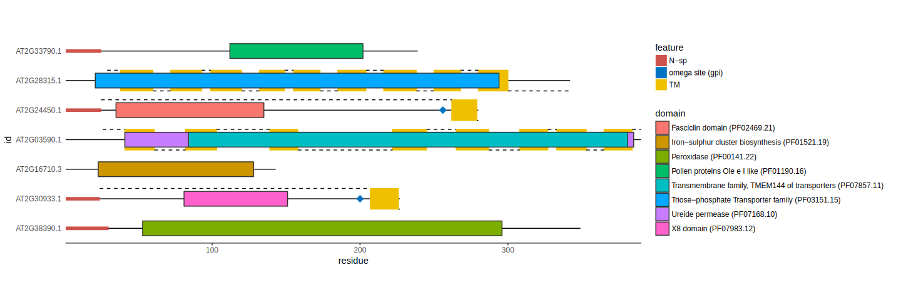

```{r setup, include = FALSE}
knitr::opts_chunk$set(
  collapse = TRUE,
  comment = "#>",
  echo = TRUE,
  warning = FALSE,
  message = FALSE,
  prompt = FALSE,
  fig.pos = 'h',
  highlight = FALSE
)
knitr::knit_theme$set("edit-matlab")
```

```{r set-options, echo=FALSE}
options(width = 120)
```

Hydroxyproline rich glycoproteins (HRGPs) are one of the most complex families of macromolecules found in plants, due to the diversity of glycans decorating the protein backbone, as well as the heterogeneity of the protein backbones. While this diversity is responsible for the wide array of physiological functions associated with HRGPs, it hinders attempts for homology based identification. Current approaches, based on identifying sequences with characteristic motifs and biased amino acid composition, are limited to prototypical sequences.  
`ragp` is an R package for mining and analyses of HRGPs, with emphasis on arabinogalactan protein sequences (AGPs). The `ragp` filtering pipeline exploits one of the HRGPs key features, the presence of hydroxyprolines which represent glycosylation sites. Main package features include prediction of proline hydroxylation sites, amino acid motif and bias analyses, efficient communication with web servers for prediction of N-terminal signal peptides and glycosylphosphatidylinositol modification sites, and the ability to annotate sequences through hmmscan and subsequent GO enrichment, based on predicted pfam domains.

The workflow in `ragp` is illustrated with the following diagram (`ragp` functions to be used for each of the tasks are boxed grey):  

```{r echo = FALSE, out.width = "70%", fig.align = "center"}
knitr::include_graphics("ragp_flow_chart.svg")
```   

* predict the presence of secretory signals (N-sp) and filter sequences containing them.  
* predict proline hydroxylation and filter sequences containing at least several potential hydroxyprolines (three or more is used in this vignette).
* optionally predict the presence of potential glycosylphosphatidylinositol attachment sites.  
* optionally annotate domains using [Pfam](https://pfam.xfam.org/).  
* find localized clusters of AG glycomodules to identify potential AGPs.  
* perform motif and amino acid bias (MAAB, Johnson *et al*., 2017) classification scheme.  

##Installation and data import

To proceed with this guide the following `R` packages are required:  

```{r libraries}
library(devtools)
library(dplyr)
library(seqinr)
library(eulerr)
library(ragp)
library(ggplot2)
```

to install `ragp`:
```{r install ragp, message = FALSE, warning = FALSE}
# install.packages("devtools")
devtools::install_github("missuse/ragp")
```

The analysis will be performed on a set of 2706 *Arabidopsis* protein sequences included in `ragp` package as the `at_nsp` data frame which contains four columns:  
```{r data}
library(ragp)
data(at_nsp)
summary(at_nsp)
```

`ragp` functions require single letter protein sequences and the corresponding identifiers as input. These can be provided in the form of basic `R` data types such as vectors or data frames. Additionally `ragp` imports the [`seqinr`](https://cran.r-project.org/web/packages/seqinr/index.html) package for the manipulation of `.FASTA` files, so the input objects can be a list of `SeqFastaAA` objects returned by the [`seqinr`](https://cran.r-project.org/web/packages/seqinr/index.html) function `read.fasta`. The location of a `.FASTA` file is also possible as a type of input.

Input options will be illustrated using `scan_ag` function:  

```{r input 1}
data(at_nsp) #a data frame of 2700 Arabidopsis protein sequences 
input1 <- scan_ag(sequence = at_nsp$sequence,
                  id = at_nsp$Transcript.id) 
```  
equivalent to: 
```{r input 2, eval = FALSE}
input2 <- scan_ag(data = at_nsp,
                  sequence = "sequence",
                  id = "Transcript.id") 
```   
same as without quotation:   
```{r input 3, eval = FALSE}
input3 <- scan_ag(data = at_nsp,
                  sequence = sequence,
                  id = Transcript.id) 
```   
A list of `SeqFastaAA` objects is also a viable input:  
```{r input 4, eval = FALSE}
#write a FASTA file
seqinr::write.fasta(sequence = strsplit(at_nsp$sequence, ""),
                    name = at_nsp$Transcript.id, file = "at_nsp.fasta")

#read a FASTA file
At_seq_fas <- read.fasta("at_nsp.fasta",
                         seqtype =  "AA", 
                         as.string = TRUE) 

input4 <- scan_ag(data = At_seq_fas) 
```   
and lastly the location of a `.FASTA` file to be analyzed as string:    
```{r input 5, eval = FALSE}
input5 <- scan_ag(data = "at_nsp.fasta") 
```  

```{r hidden, echo = FALSE}
vigfiles <- readRDS("vig_files.rds")
id_nsp <- vigfiles$id_nsp
at_hmm <- vigfiles$at_hmm
nsp_signalp <- vigfiles$nsp_signalp
at_gpi <- vigfiles$at_gpi
p1 <- vigfiles$p1
p2 <- vigfiles$p2
p3 <- vigfiles$p3
at_nsp2 <- dplyr::filter(at_nsp, Transcript.id %in% id_nsp)

```

##Predicting N-terminal secretory signal sequences (N-sp)

HRGPs are secreted proteins, therefore they are expected to contain a secretory signal sequence on the N-terminus (N-sp). `ragp` incorporates N-sp prediction by querying [SignalP](http://www.cbs.dtu.dk/services/SignalP/), [TargetP](http://www.cbs.dtu.dk/services/TargetP/) [@emanuelsson_predicting_2000] and [Phobius](http://phobius.sbc.su.se/) [@kall_advantages_2007] in an efficient manner via the functions: `get_signalp`, `get_targetp` and `get_phobius`.

To query [SignalP](http://www.cbs.dtu.dk/services/SignalP/) predictions:  

```{r SignalP1, eval = FALSE}
nsp_signalp <- get_signalp(at_nsp,
                           sequence,
                           Transcript.id)
```  

The predictions for the 2700 sequences contained in `at_nsp` data frame should be available in around 1 minute. When handling large FASTA files with many sequences it is recommended to split them into smaller files each containing 10000 - 20000 sequences, using the `ragp` function `split_fasta` and to obtain predictions in a loop. The returned object `nsp_signalp` is a data frame resembling the web servers output:  

```{r SignalP2}
head(nsp_signalp[,-c(1,10)]) #omitting columns "id" and "Networks.used"
```  

similarly [TargetP](http://www.cbs.dtu.dk/services/TargetP/) and [Phobius](http://phobius.sbc.su.se/) can be queried by:

```{r TargetP1, eval = FALSE}
nsp_targetp <- get_targetp(at_nsp,
                           sequence,
                           Transcript.id)

nsp_phobius <- get_phobius(at_nsp,
                           sequence,
                           Transcript.id)
```  

The concordance of the predictions will be checked with Euler diagrams:  

```{r euler, eval = FALSE}
set.seed(5)
bind_cols(nsp_signalp, nsp_targetp, nsp_phobius) %>%
  select(is.phobius, is.targetp, is.signalp) %>%
  euler(shape = "ellipse", input = "disjoint") %>% 
  plot(quantities = T)  
```

```{r echo = FALSE, out.width = "40%", fig.align = "center"}
knitr::include_graphics("eulerr.svg")
```   

The three servers do not agree completely therefore we recommend using the majority vote to predict if the protein is secreted: 

```{r euler2, eval = FALSE}
bind_cols(nsp_signalp, nsp_targetp, nsp_phobius) %>%
  select(is.phobius, is.targetp, is.signalp, id) %>%
  mutate(vote = rowSums(.[,1:3])) %>% 
  filter(vote >= 2) %>%
  pull(id) -> id_nsp 

at_nsp2 <- filter(at_nsp, Transcript.id %in% id_nsp)
```


This will create `at_nsp2` data frame with `r nrow(at_nsp2)` sequences.

##Predicting proline hydroxylation

The key feature of HRGPs is the presence of hydroxyprolines (Hyp, O) which represent glycosylation sites [@showalter_bioinformatics_2010]. While many HRGPs can be found based on biased amino acid composition, or the presence of certain amino acid motifs, there exists an abundance of chimeric proteins comprised from specific domains and HRGP motifs which are much harder to identify based on the mentioned features. In an attempt to identify these types of sequences `ragp` incorporates a model specifically built to predict the probability of proline hydroxylation in plant proteins. This model is incorporated in the `predict_hyp` function and can be utilized to filter potential HRGPs.  

```{r predict 1}
at_hyp <- predict_hyp(data = at_nsp2,
                      sequence = sequence,
                      id = Transcript.id)
```     

The object returned by `predict_hyp` is a list with two elements `prediction` and `sequence`. The `prediction` element is a data frame containing the probability of hydroxylation for each P in each sequence along with the amino acid span used for prediction. First few rows of this element:  
```{r filter hyp show}
head(at_hyp$prediction)
```

These predictions are based on a probability threshold of 0.3 which offers the best trade-off between specificity and sensitivity. To increase specificity at the cost of sensitivity the threshold can be increased using the `tprob` argument: 

```{r predict 2, eval = FALSE}
at_hyp2 <- predict_hyp(data = at_nsp2,
                       sequence = sequence,
                       id = Transcript.id,
                       tprob = 0.6)
```   

The `at_hyp` object can be used to filter the sequences that contain more than a certain number of hydroxyprolines. The default threshold of 0.3 will be used. To filter sequences with three or more O:  

```{r filter hyp three or more}
at_hyp$prediction %>%
  group_by(id) %>%
  summarise(n = sum(HYP == "Yes")) %>%
  filter(n >= 3) %>%
  pull(id) -> at_3hyp

at_nsp2 %>%
  filter(Transcript.id %in% at_3hyp) -> at_nsp_3hyp
```

There are `r nrow(at_nsp_3hyp)` sequences that satisfy this condition.  

##Domain annotation and GPI prediction

Domain annotation is a fundamental research tool in protein sequence analyses. In many occasions domain annotation has already been performed prior to HRGP mining, either by using [hmmer](http://hmmer.org/) [@eddy_accelerated_2011], [InterProScan](https://www.ebi.ac.uk/interpro/interproscan.html) [@jones_interproscan_2014] or some other resource. In such circumstances the annotation can be imported into `R` and joined with the filtered sequences. When this is not the case `ragp` offers the function `get_hmm` which queries the [hmmscan](https://www.ebi.ac.uk/Tools/hmmer/search/hmmscan) web server [@finn_hmmer_2011]. Domain annotation is not necessary for AGP prediction although it enhances interpretation, but it is a fundamental part of the MAAB classification scheme. As with other `ragp` functions the first argument is the `data`, followed by the names of the columns containing the protein sequences and corresponding identifiers:

```{r hmmscan 1, eval = FALSE}
at_hmm <- get_hmm(at_nsp_3hyp,
                  sequence,
                  Transcript.id)
```

The resulting data frame resembles the web server's output, or for those familiar with the [`hmmer`](http://hmmer.org/) software the domain hits table produced by using the argument `--domtblout`. First few rows with several columns omitted:  

```{r hmmscan 2}
head(at_hmm[,-c(4, 5, 8, 9, 11:13)])
```

HRGPs, and especially AGPs are often linked to the membrane by a glycosylphosphatidylinositol (GPI) anchor [@ellis_arabinogalactan-proteins:_2010]. Attachment of the GPI moiety to the carboxyl terminus (omega-site) of the polypeptide occurs after proteolytic cleavage of a C-terminal propeptide. In order to predict the presence of the omega sites in the filtered sequences the function `get_big_pi` can be utilized which queries the [big-PI Plant Predictor](http://mendel.imp.ac.at/gpi/plant_server.html) [@eisenhaber_glycosylphosphatidylinositol_2003]. 

```{r big_pi, eval = FALSE}
at_gpi <- get_big_pi(at_nsp_3hyp,
                     sequence,
                     Transcript.id)
```

This function provides detailed per sequence output when the argument `simplify` is set to `FALSE`, by default `simplify` is set to `TRUE` and the resulting data frame has one row per sequence:  

```{r big_pi 2}
head(at_gpi)
```

##Arabinogalactan identification

To check which of the filtered sequences are potential arabinogalactans the function `scan_ag` can be used. This function scans the protein sequences for AG glycomodule clusters, by constructing regular expressions based on user input. By default `scan_ag` searches for at least three dipeptides PA, PS, PT, PG, PV, AP, SP, TP, GP and VP which are separated by maximally 10 amino acids. The minimal number of dipeptides to be considered can be changed by the argument `dim` while the maximum number of separating amino acids can be tweaked using the argument `div`. To consider only PA, PS, PT, AP, SP and TP dipeptides the `type` argument can be changed to `"conservative"`. In cases when the dipeptides are ambiguous, such as SPT, PTP etc. all three amino acids will be counted as one dipeptide, while cases such as PTPA are considered as two dipeptides separated by zero amino acids. When the `sequence` object from `predict_hyp` function is passed to `scan_ag` only prolines predicted to be hydroxylated are considered when searching for dipeptides:  

```{r scan_ag}
scaned_at <- scan_ag(data = at_nsp_3hyp,
                     sequence,
                     Transcript.id)
```  

The output object `scaned_At` can be a list, or a data frame depending on the `simplify`/`tidy` arguments. The default output is a data frame one row per sequences with five columns. Here are the 55 N-terminal amino acids from the [Classical arabinogalactan protein 9](http://www.uniprot.org/uniprot/Q9C5S0) as an example:  

```{r scan_ag2}
scaned_at  %>%
  mutate(sequence = strtrim(sequence, 55)) %>%
  select(-3) %>% #omitting 3rd column
  filter(id == "AT2G14890.1")
```  

The column "sequence" contains the input sequence where only the amino acids in potential AG glycomodules are in uppercase while all other are in lower case.  The column "AG_aa" contains the amino acid count found in potential AG glycomodules, while columns "total_length" and "longest" correspond to the matched sequence spans.  
True AG glycomodules contain hydroxyproline instead of proline in the dipeptides: OA, OS, OT, AO, SO and TO (and probably OG, OV, GO and VO) but the above output considers P instead of O since most of the time the positions of O are unknown. However if the sequence argument to `scan_ag` contains O's at some positions, `scan_ag` will consider only them. To do this the `sequence` output of `predict_hyp` function can be used:  

```{r scan_ag3}
scaned_at <- scan_ag(data = at_hyp$sequence,
                     sequence,
                     id)
```  

The 55 N-terminal amino acids from the [Classical arabinogalactan protein 9](http://www.uniprot.org/uniprot/Q9C5S0):  

```{r scan_ag4}
scaned_at  %>%
  mutate(sequence = strtrim(sequence, 55)) %>%
  select(-3) %>% 
  filter(id == "AT2G14890.1")
```  

Extensin motifs in the form of SPPP+/SOOO+ are also detected by `scan_ag` if in correct context, to avoid this add `exclude_ext = "yes"` as an argument:  

```{r scan_ag5}
scaned_at <- scan_ag(data = at_hyp$sequence,
                     sequence,
                     id,
                     exclude_ext = "yes")

scaned_at  %>%
  mutate(sequence = strtrim(sequence, 55)) %>%
  select(-3) %>%
  filter(id == "AT2G14890.1")
```  

to switch of all PPP+/OOO+ from being detected: 

```{r scan_ag6}
scaned_at <- scan_ag(data = at_hyp$sequence,
                     sequence,
                     id,
                     exclude_ext = "all")

scaned_at  %>%
  mutate(sequence = strtrim(sequence, 55)) %>%
  select(-3) %>%
  filter(id == "AT2G14890.1")
```  

To disregard VP, PV, GP, PG and the corresponding hydroxyproline dipeptides:  

```{r scan_ag7}
scaned_at <- scan_ag(data = at_hyp$sequence,
                     sequence,
                     id,
                     type = "conservative")

scaned_at  %>%
  mutate(sequence = strtrim(sequence, 55)) %>%
  select(-3) %>%
  filter(id == "AT2G14890.1")
```  

```{r scan_ag8, echo = FALSE}
scaned_at <- scan_ag(data = at_hyp$sequence,
                     sequence,
                     id)

```  

With default settings `scan_ag` identifies `r sum(scaned_at$total_length != 0)` sequences. To compare it with the number of sequences that would be filtered if the proline hydroxylation prediction was omitted the function can be run on `at_nsp2` data:

```{r scan_ag9}
scaned_at_nsp2 <- scan_ag(data = at_nsp2,
                          sequence,
                          Transcript.id)

sum(scaned_at_nsp2$total_length != 0)
```  

Thus the prediction of hydroxyprolines greatly reduced the pull of potential arabinogalactans.  
`scan_ag` is capable of identifying potential chimeric and short AGPs without pronounced amino acid bias and with few characteristic motifs. In combination with `predict_hyp` the specificity of the found sequences is greatly increased since the majority of sequences unlikely to contain hydroxyprolines are excluded. 

##Motif and amino acid bias classification - MAAB

The MAAB pipeline is explained in detail in @johnson_pipeline_2017. In short, after removal of sequences without a predicted N-sp and removal of sequences with predicted domains the sequences are first evaluated for amino acid bias. Sequences with  > 45% of PAST (AGP bias) or PSKY (EXT bias) or PVKY (proline-rich proteins (PRP) bias) are grouped further into 24 distinct groups based on amino acid bias, presence of GPIs and the following motifs (as regular expression):  

* EXT: the SPn motif `SP{3,5}` and the tyr motifs `[FY].Y`, `KHY`, `VY[HKDE]`, `V.Y` and `YY`.  
* PRP: `PPV.[KT]`, `PPV[QK]` and `KKPCPP`.  
* AGP: `[AVTG]P{1,3}` and `[ASVTG]P{1,2}`.  

The motifs are counted in a specific order ext > tyr > prp > agp, and overlapping motifs are not counted twice. Based on the final motif count and the overall coverage of the motifs HRGPs are clustered in the mentioned 24 groups. This can be performed using the `ragp` function `maab`: 

```{r maab 1}
maab_at <- maab(at_nsp_3hyp,
                sequence,
                Transcript.id)
```

Of the `r nrow(at_nsp_3hyp)` sequences in `at_nsp_3hyp`, `r sum(maab_at$maab_class != "0")` are predicted to belong to any of the HRGP classes (1 - 24). The output of the `maab` function is a data frame containing columns: `id` - sequence identifier; `ext_sp`, `ext_tyr`, `prp` and `agp` - corresponding motif count; `past_percent`, `pvyk_percent`, `psky_percent`, `p_percent` - percentage of the corresponding amino acids in sequence; `coverage` - the motif coverage; `maab_class` - the MAAB class. The first several hits: 

```{r maab 2}
maab_at %>%
  filter(maab_class != "0") %>%
  select(-ends_with("percent")) %>% #omitting columns ending with "percent"
  head 
```

Since the function was not provided knowledge on the GPI presence, both possible classes are indicated as in: "1/4" or "2/9". GPI presence can be indicated with the argument `gpi` which accepts a Boolean vector of the same length as the sequences, like the `is.bigpi` column from the output of `get_big_pi` function:   

```{r maab 3}
maab_at <- maab(at_nsp_3hyp,
                sequence,
                Transcript.id,
                gpi = at_gpi$is.bigpi)

maab_at %>%
  filter(maab_class != "0") %>%
  select(-ends_with("percent")) %>% 
  head 
```

A faster way to remove ambiguities in classes if GPI presence is unknown is to set `get_gpi` argument to `TRUE`:

```{r maab 4, results ="hide", eval = FALSE}
maab_at <- maab(at_nsp_3hyp,
                sequence,
                Transcript.id,
                get_gpi = TRUE)
```
```{r maab 5}
maab_at %>%
  filter(maab_class != "0") %>%
  select(-ends_with("percent")) %>% 
  head 
```

This will run `get_big_pi` only on the sequences that belong to one of the HRGP classes thus resolving class ambiguities that depend on GPI knowledge.

##Protein structure diagram

All of the above mentioned protein features can be visualized using the function `plot_prot`. It accepts protein sequences in the form of strings, calls the above mentioned functions to obtain sequence features and returns a `ggplot` object:

```{r plot_prot1, eval = FALSE}
ind <- c(20, 23, 34, 52, 80, 127, 345) #some sequences
p1 <- plot_prot(sequence = at_nsp$sequence[ind],
                id = at_nsp$Transcript.id[ind])

p1
```
```{r echo = FALSE, out.width = "100%", fig.align = "center"}

```   

Trans membrane regions (TM) are shown in yellow, extracellular regions are indicated by the dashed line above the sequences while intracellular regions are indicated by the dashed line bellow the sequence (as predicted by Phobius). Signal peptides (as predicted by SignalP) are indicated by the thick red line on the N-terminal side. Signal peptides (as predicted by Phobius) can be deduced by the start of the dashed lines. GPI attachment sites (as predicted by Big Pi) are indicated by blue rhomboids. Hydroxyprolines (as predicted by `predict_hyp`) are indicated by vertical dark gray lines while AG glycomodul spans are indicated by the light grey background. Domains (as predicted by hmmscan) are indicated by rectangles with an appropriate fill as indicated in the legend.

To change the axis ratio:
```{r plot_prot3, eval = FALSE}
p1 +
  coord_equal(ratio = 50)
```
```{r echo = FALSE, out.width = "100%", fig.align = "center"}

```   

To change the domain colors use another fill palette:  
```{r plot_prot4, eval = FALSE}
p1 +
  scale_fill_brewer(type = "div")
```
```{r echo = FALSE, out.width = "100%", fig.align = "center"}

```   

To change feature colors set them as arguments (`hyp_col`, `gpi_col`, `nsp_col`, `ag_col` and `tm_col`) to `plot_prot`:  

```{r plot_prot5, eval = FALSE}
p3 <- plot_prot(sequence = at_nsp$sequence[ind],
                id = at_nsp$Transcript.id[ind],
                hyp_col = "brown",
                ag_col = "orange")
p3
```

```{r echo = FALSE, out.width = "100%", fig.align = "center"}

```   

or use another color palette:

```{r plot_prot7, eval = FALSE}
p1 +
  scale_fill_brewer(type = "div")+
  scale_color_brewer(type = "qual")
```
```{r echo = FALSE, out.width = "100%", fig.align = "center"}
knitr::include_graphics("p1_fill_color.svg")
```   

Choose which features to plot when calling `plot_prot`:

```{r plot_prot8, eval = FALSE}
p2 <- plot_prot(sequence = at_nsp$sequence[ind],
                id = at_nsp$Transcript.id[ind],
                hyp = FALSE,
                ag = FALSE)
p2
```
```{r echo = FALSE, out.width = "100%", fig.align = "center"}

```  


#References  